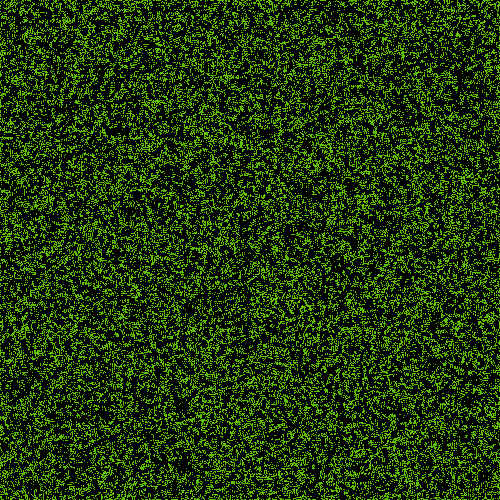

<p align="center">

<h3 align="center">

Game of Life in R | Version 1.0

</h4>

<p align="center">

<a href="https://www.tidyverse.org/lifecycle/#archived">

</a> <a href="https://travis-ci.org/frahik/GameOfLife-R">

</a> <a href='https://coveralls.io/github/frahik/GameOfLife-R'>

</a> <a href="https://www.gnu.org/licenses/lgpl-3.0">

</a> <a href="http://www.repostatus.org/#inactive">

</a>

</p>

<h4 align="center">

\[Last README update: 2019-02-07\]

</h4>

</p>

-----

The Game of Life is a ‘cellular automaton’, and was invented by
Cambridge mathematician John Conway.

This ‘package’ is an simple example of this game.

To complete installation of this version, use the followin code.

``` r
install.packages('devtools')
devtools::install_github('frahik/GameOfLife-R')
```

<h2 id="example">

Example of use

</h2>

``` r
library(GameOfLife)
game_of_life(sandbox_dimension = 500, probability_of_initial_existence = 0.5, delay_time = 30, iterations = 200, path = '')
```

This is the output on the path folder.

<a href="https://github.com/frahik/GameOfLife-R">

</a>

<h2 id="authors">

Authors

</h2>

  - Francisco Javier Luna-Vázquez (Author, Maintainer)
